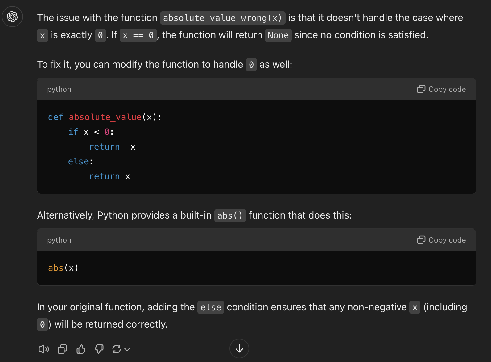
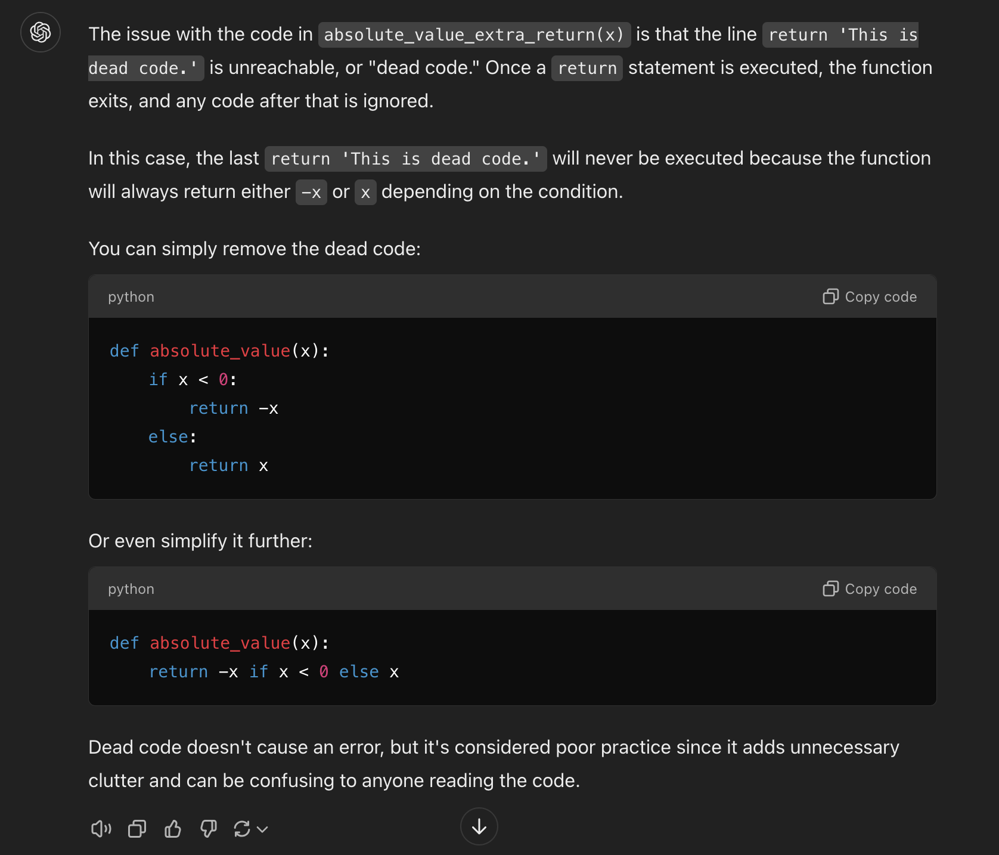
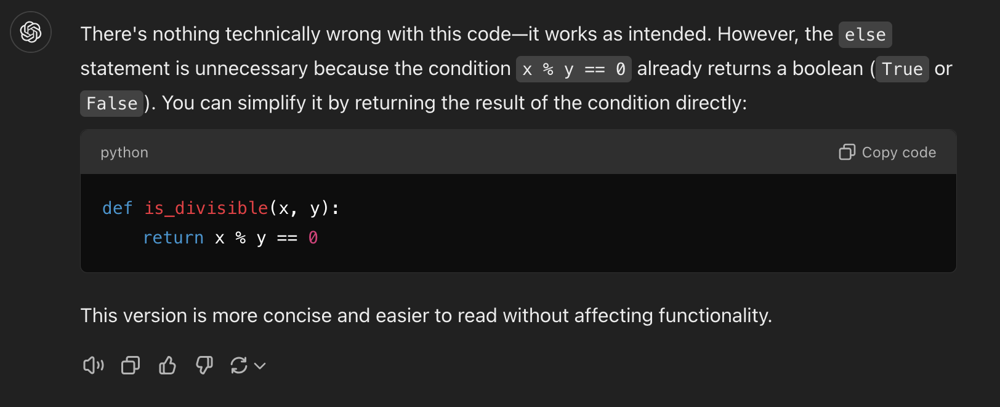
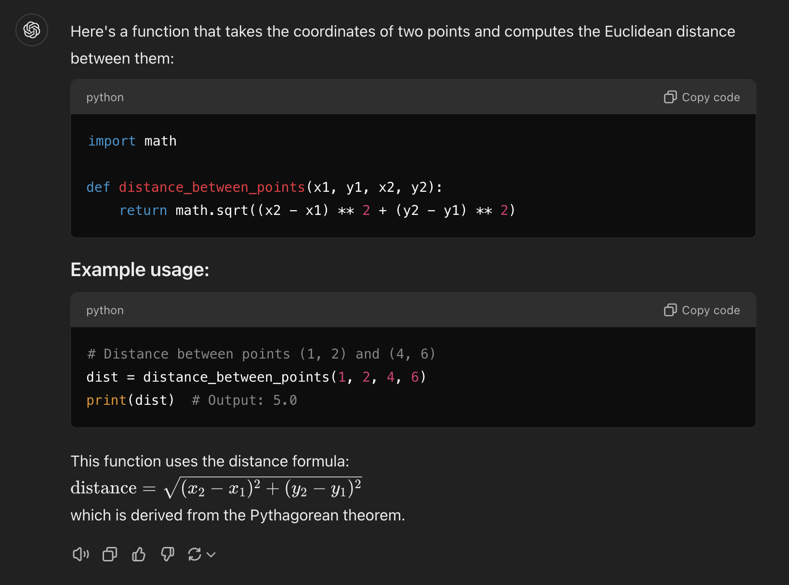

# Excercise 01

## AI Error Spotting

### Ending Without a Return
```python
def absolute_value_wrong(x):
    if x < 0:
        return -x
    if x > 0:
        return x
```


### Spot the Dead Code
```python
def absolute_value_extra_return(x):
    if x < 0:
        return -x
    else:
        return x
    
    return 'This is dead code.'
```


### Non Idiomatic Code
```python
def is_divisible(x, y):
    if x % y == 0:
        return True
    else:
        return False
```


### Distance Variance
* Here is our distance equation! Kinda local-variable heavy if you ask me!
```python
import math

def distance(x1, y1, x2, y2):
    dx = x2 - x1
    dy = y2 - y1
    dsquared = dx**2 + dy**2
    result = math.sqrt(dsquared)
    return result
```
* The AI version accomplishes the task in a much more concise and idiomatic way!
